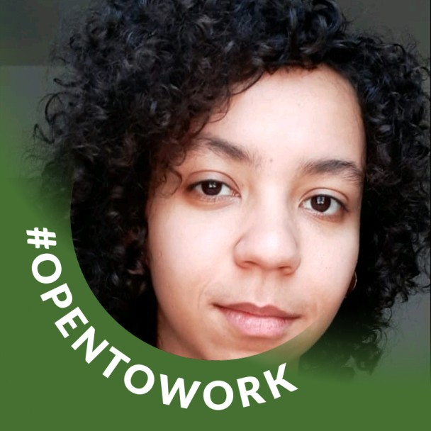

  

<h1 align="center">FINANCIAMENTO ECOLETIVO</h1>

Concluído 🚀

  <a href="#Sobre">Sobre</a> •
  <a href="#Funcionalidades">Funcionalidades</a> •
  <a href="#Executar">Como Executar</a> •
  <a href="#Tecnologias">Tecnologias</a> •
  <a href="#Integrantes">Integrantes</a> •
  <a href="#Licenca">Licença</a>

<h2 id="Sobre">:computer: Sobre o projeto</h2>

  FINANCIAMENTO ECOLETIVO: Uma plataforma que permite com que as pessoas publiquem, financiem e ajudem projetos voltados ao nosso querido planeta Terra com base na ODS 15 da ONU - Vida Terrestre.

  Esse projeto foi acompanhado pelos instrutores <a href="https://www.linkedin.com/in/thicode/">Thiago Lima</a> e <a href="https://www.linkedin.com/in/geandro-ara%C3%BAjo-1b19881b4/">Geandro Araújo</a> para que os alunos pudessem colocar em prática os conhecimentos do módulo 3, de frontend, no Projeto Integrador do grupo 4 da turma 19 da <a href="https://brazil.generation.org/">Generation Brasil</a>. 

<h2 id="Funcionalidades">⚙️ Funcionalidades</h2>

<h3>Usuário</h3>

  - [x] Cadastrar
  - [x] Atualizar
  - [x] Logar

<h3>Postagem:</h3>

  - [x] Postar
  - [x] Consultar todas as postagens
  - [x] Consultar as postagens do usuário logado
  - [x] Consultar as postagens pelo tema 
  - [x] Consultar as postagens com base no título
  - [x] Consultar as postagens pelo usuário  
  - [x] Alterar postagem
  - [x] Fazer uma doação para uma postagem
  - [x] Deletar postagem

<h3>Tema</h3>

  - [x] Criar tema
  - [x] Alterar cadastro de tema
  - [x] Deletar cadastro de tema

Um pouco do projeto: 

<h2 id="Executar">🚀 Como executar o projeto</h2>

Para acessar o projeto clique <a href="https://financiamento-ecoletivo.netlify.app/#/inicial">aqui</a>. OBS: a API, que está sendo consumida, está no Heroku, então, pode ser que demore um pouco a primeira requisição.

Esse projeto consumiu essa <a href="https://github.com/caio199307/Projeto_IntegradorG4">API - REST</a>

<h2 id="Tecnologias">🛠 Tecnologias</h2>

Utilitários:

<h2 id="Integrantes">👨‍💻 Integrantes do Grupo</h2>

Esse projeto foi feito com muito ❤️ e carinho por essa galera, entre em contato :D

<table>
  <tr>
    <td>
        
      <a href="https://www.linkedin.com/in/anderson-correia/">
Anderson Correia
</a>
    </td>
    <td>
      
      <a href="https://www.linkedin.com/in/caiovitorfdev/">
Caio Vitor
</a>
    </td> 
    <td>
      
      <a href="https://www.linkedin.com/in/valisopmacamilla/">
Camilla Campos
</a>
    </td>
    <td>
      
      <a href="https://www.linkedin.com/in/tamires-alves-dos-santos-8893591a9/">
Tamires Alves
</a>
    </td>
  </tr>
</table>

<h2 id="Licenca">📝 Licença</h2>

Este projeto esta sob a licença <a href="https://github.com/Anderson815/Financiamento_Ecoletivo/blob/89857883ee2b52865098bfb328aaa76b1955c00d/LICENSE">MIT</a>.

